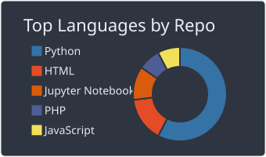
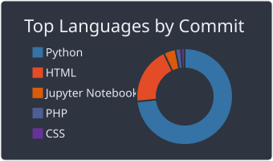
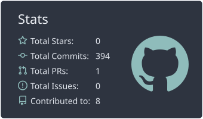
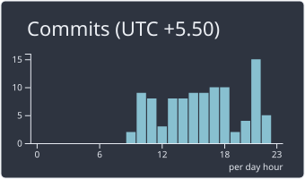

<div align="center">


</div>

```bash
$ whoami --verbose

> Naitik Soni · Ahmedabad, IN
> role      : Computer Vision Engineer, 2+ yrs in production
> employer  : Silver Touch Technologies
> mission   : teach machines to detect, track, and read the world correctly
```

<br>

## `>_` detection_output.log

Running a scan on my own skillset. Confidence scores below aren't decorative — they're roughly how deep each one actually goes.

```
$ python detect_skills.py --input naitik_soni --conf 0.25

Detections:
  yolov8_object_detection        ████████████████████░  96%
  multi_object_tracking          ███████████████████░░  93%
  face_recognition_pipelines     ███████████████████░░  92%
  ocr_document_ai                ██████████████████░░░  89%
  kalman_filtering                █████████████████░░░░  85%
  fastapi_backend_systems         █████████████████░░░░  84%
  visual_slam                     ██████░░░░░░░░░░░░░░░  28%   [in progress]

7 objects detected. inference time: 2 years, 0 hallucinations.
```

<br>

## `>_` beyond_the_badges.trace

Anyone can `import ultralytics`. This is the layer most profiles skip — the motion-estimation and tracking theory built from first principles, not just called via a library.

```
[TRACE] optical_flow      : Lucas-Kanade · FlowNet · FlowNet2.0 · PWC-Net · RAFT
[TRACE] filtering         : Kalman Filter · Hungarian Algorithm
[TRACE] mot_algorithms    : KCF · SORT · DeepSORT · ByteTrack · BoT-SORT
[TRACE] feature_detection : Harris Corners · SIFT · ORB · KLT

[NOTE]  SORT tracker rebuilt from scratch (filterpy + scipy) on synthetic
        video — not to get a tracker working, but to study *why* trackers
        fragment under occlusion.
```

<br>

## `>_` featured_build — retail_footfall_analytics

```
 ┌───────────┐     ┌─────────────┐     ┌──────────────┐     ┌───────────────┐     ┌────────────┐
 │  Frame In │ ───▶│ YOLOv8      │ ───▶│  BoT-SORT    │ ───▶│ Line-Crossing │ ───▶│ CSV Report │
 │  (stream) │     │ Detection   │     │  Tracking    │     │ + Hourly Agg. │     │  Output    │
 └───────────┘     └─────────────┘     └──────────────┘     └───────────────┘     └────────────┘
```

Architected around a `FrameContext` dataclass and a `Stage` abstract-base pattern, so detection, tracking, and counting stay decoupled and independently testable — not a demo script bolted together. Outputs traffic-classified CSV reports ready for downstream analysis.

<br>

## `>_` git_log --experience

```
commit  2024-07  Junior Programmer @ Silver Touch Technologies
Author: Naitik Soni
        - built production OCR pipeline (Tesseract / DocTR / Docling / PaddleOCR benchmarked)
        - cut per-doc processing: up to 1hr manual -> 4 pages/min, zero manual correction
        - SIFT + histogram equalization preprocessing for degraded, noisy scans
        - fine-tuned YOLOv8 for signature detection, killed a 100% manual bottleneck

commit  2024-01  Software Trainee Engineer @ Silver Touch Technologies
Author: Naitik Soni
        - built Python RPA bot, removed hours/week of manual workflow effort
        - owned full data pipeline (collect -> label -> train) for a self-driving
          car prototype, >90% accuracy in simulation
```

<br>

## `>_` shipped_projects

| build | pipeline | result |
|---|---|---|
| 🧍 **Retail Footfall Analytics** | `YOLOv8 → BoT-SORT → line-crossing → CSV` | modular, production-style architecture |
| 🎯 [**Multi-Tenant Attendance System**](https://github.com/Naitik-Soni/Smart-Attendance-System) | `RetinaFace → ArcFace → FastAPI` | full HLD/LLD, multi-tenant isolation |
| 📄 **Document OCR Pipeline** | `PaddleOCR / DocTR / Docling → structured output` | 4 pages/min, zero manual correction |
| ✍️ **Signature Detection** | `YOLOv8 fine-tune` | replaced a 100% manual bottleneck |
| ✋ [**Hand Cricket Runs Counter**](https://github.com/Naitik-Soni/Hand-cricket-runs-counter) | `MediaPipe → custom NN` | 98.6% accuracy, loss 0.05 |

<br>

## `>_` stack

<div align="center">


</div>

<br>

## `>_` next_target.log

```
[QUEUE] video_analytics
[QUEUE] surveillance_systems
[QUEUE] drone_perception
[QUEUE] autonomous_vehicle_perception
[LEARNING_PATH] multi-camera tracking -> re-identification -> visual SLAM
```

<br>

<div align="center">






</div>

```bash
$ contact --naitik

> linkedin  : linkedin.com/in/naitiktsoni
> github    : github.com/Naitik-Soni
> twitter   : twitter.com/Naitik_Soni_17
> email     : naitiksoni1705@gmail.com
```

<div align="center">

</div>
